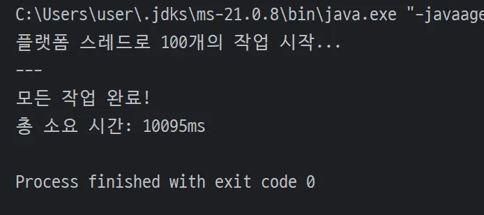
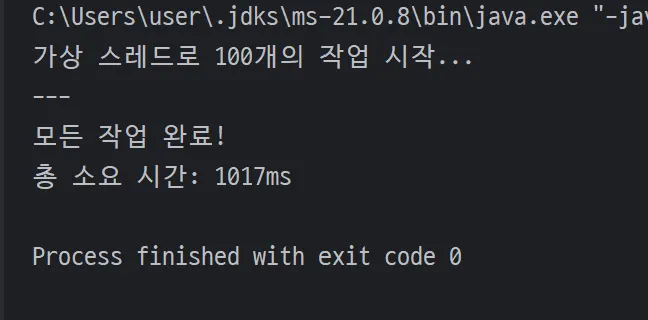

## 들어가기 전

가상 스레드를 이해하기 전 **프로세스와 스레드, 비동기와 동기의 이해**가 우선이라고 생각했어요.
그래서 간단히 알아본 후 가상 스레드에 대해서 알아볼게요!

### 프로세스와 스레드

- 프로세스(Process) : 실행 중인 프로그램의 인스턴스.
  각 프로세스는 운영체제로부터 **"독립적인 메모리 공간"** 을 할당받아 다른 프로세스에 영향을 주지 않아요.

- 스레드(Thread) : 프로세스 안에서 실행되는 작업의 단위.
  한 프로세스에는 여러 개의 스레드가 존재할 수 있으며, 이 스레드들은 **"프로세스의 메모리 공간을 공유"** 해요. 이를 통해 한 프로그램이 여러 작업을 동시에 처리할 수 있게 돼요.

예를 들어, 워드 애플리케이션은 프로세스 / 맞춤법 검사, 이미지 로딩 등을 처리하는 것은 스레드라고 생각하면 이해하기 쉬울 것 같아요.

#### 그래서 뭐가 다르죠?

|         -          |               프로세스                |               스레드               |
| :----------------: | :-----------------------------------: | :--------------------------------: |
|  **메모리 공간**   |                독립적                 |   프로세스 메모리  공간 공유    |
|   **자원 공유**    |             어렵고 복잡함             |          용이하고 효율적           |
|  **동시성 문제**   |              비교적 안전              | 발생 가능성 높음  (동기화 필요) |
| **생성/관리 비용** |          무거움 (높은 비용)           |         가벼움 (낮은 비용)         |
|   **상호 통신**    | IPC(Inter-Process Communication) 사용 |     직접 메모리 접근으로 빠름      |

우리는 이제 스레드를 통해 여러 작업을 동시에 처리할 수 있게 되는 것을 이해했어요.
만약, 여러 사용자 요청이 한 번에 들어올 경우 스레드는 해당 작업을 어떻게 처리할까요?

### 동기와 비동기

- **동기(Synchronous)** : 작업이 순서대로 진행되는 방식이에요. 한 작업이 끝날 때까지 다음 작업은 시작할 수 없어요.
  예를 들어, 당신이 커피숍에 가서 커피를 주문하고, 커피가 나올 때까지 카운터 앞에서 기다리는 것과 같아요. 기다리는 동안 다른 일은 할 수 없게 돼요.

- **비동기(Asynchronous)** : 작업이 순서에 상관없이 진행되는 방식이에요.
  작업을 시작해놓고 기다리지 않고 바로 다음 작업을 진행해요.
  예를 들어, 커피를 주문하고 "커피가 나오면 불러주세요"라고 말한 뒤, 잠시 의자에 앉아 휴대폰을 보는 것과 같아요. 기다리는 동안 다른 일을 할 수 있어 시간을 효율적으로 쓸 수 있어요.

여기서 집중해서 봐야할 건 **자원 낭비** 에요.

동기 방식으로 작업을 처리할 경우 작업이 끝날 때까지 스레드(작업자)가 아무것도 하지 않고 대기하게 되는데, 이것을 **블로킹(Blocking)** 이라고 해요.

하지만, 비동기 방식은 스레드가 대기하지 않고 계속해서 다른 작업을 할 수 있어 자원 효율이 좋아요.

> #### ❓ Blocking VS.Non-Blocking
>
> - **블로킹(Blocking)** : 동기 방식에서 발생하는 현상입니다.
>   I/O 작업(데이터베이스 조회, 파일 읽기 등)이 완료될 때까지 해당 스레드가 멈춰 서서 대기하는 것을 의미합니다.
>
> - **논블로킹(Non-Blocking)** : 비동기 방식에서 주로 사용됩니다.
>   작업을 요청한 후 바로 제어권을 반환받아 다른 일을 계속할 수 있습니다.

### 가상 스레드와 플랫폼 스레드의 차이

**관리 주체**와 **무게**에서 가장 큰 차이가 있어요.

- **플랫폼 스레드 (Platform Thread)** : 우리가 흔히 '스레드'라고 부르는 것으로, **운영체제(OS)가 직접 관리**하는 스레드에요.
  이 스레드는 OS의 스케줄러에 의해 CPU 코어에 할당되고, 생성과 소멸에 많은 시간과 메모리가 소모되어 "무겁다"고 표현해요. 그래서 수천, 수만 개를 동시에 만드는 것은 현실적으로 어려워요.
- **가상 스레드 (Virtual Thread)** : **JVM(Java Virtual Machine)이 직접 관리**하는 스레드에요. 플랫폼 스레드를 기반으로 하지만, 훨씬 가볍고 빠르게 생성돼요.
  마치 플랫폼 스레드 위에서 작동하는 '경량 스레드'와 같아서 수십만 개를 동시에 생성할 수 있을 정도로 비용이 매우 저렴해요.

|                플랫폼 스레드                 |                가상 스레드                |
| :------------------------------------------: | :---------------------------------------: |
|  |  |

### 가상 스레드를 왜 써야해요?

#### 블로킹(Blocking)의 문제점

우리가 앞서 본 동기(Synchronous) 방식은 코드를 직관적으로 작성할 수 있어 편리하지만, 치명적인 단점이 있어요. 바로 블로킹(Blocking) 현상이에요.

예를 들어, 웹 서버가 데이터베이스에 접근하여 데이터를 요청하는 상황을 가정해 볼게요.
이 작업은 I/O(Input/Output) 작업이라서 CPU가 직접 처리하는 것이 아니라, 데이터를 가져올 때까지 기다려야 해요.

기존 플랫폼 스레드(Platform Thread)는 I/O 작업이 완료될 때까지 아무것도 하지 않고 멈춰서 기다려요. 즉, 스레드가 데이터가 올 때까지 기다리는 거죠.

이때 동시에 많은 사용자가 접속하면 수많은 스레드가 대기 상태에 빠지고, 결국 새로운 요청을 처리할 수 있는 스레드가 부족해져 서버의 성능이 급격히 저하돼요.

이 문제를 해결하기 위해 **비동기(Asynchronous)** 방식이 등장했지만, CompletableFuture나 콜백(Callback)을 사용해야 해서 코드가 매우 복잡해지는 단점이 있었어요.

#### Virtual Thread 등 - 장 🌟

가상 스레드는 이 두 가지 문제(동기식의 비효율, 비동기식의 복잡성)를 한 번에 해결할 수 있어요.

가상 스레드는 플랫폼 스레드 위에서 실행되는 **"매우 가벼운 스레드"** 에요.
가상 스레드가 I/O 작업을 시작하여 대기 상태에 들어가면, JVM이 이 가상 스레드를 잠시 플랫폼 스레드에서 내려놓고(unmount), 플랫폼 스레드는 다른 가상 스레드를 실행해요.

개발자는 `Thread.sleep()` 처럼 스레드를 블로킹시키는 익숙한 코드를 그대로 사용해도, 실제로는 I/O 대기 시간 동안 플랫폼 스레드가 낭비되지 않고 여러 가상 스레드를 번갈아 처리해요. 덕분에 수십만 개의 동시 요청도 효율적으로 처리할 수 있게 되었어요.

#### 장점

- 높은 동시성(High Concurrency): 매우 가벼워서 수십만 개의 스레드를 생성할 수 있어, I/O 작업이 많은 **애플리케이션의 처리량** 을 극적으로 높여줘요.

- 쉬운 개발: 복잡한 비동기 API를 사용하지 않고도 기존의 동기식 코드 스타일을 유지할 수 있어 **개발 생산성이 향상**돼요.

- 기존 코드 호환성: 대부분의 기존 자바 라이브러리 및 프레임워크와 호환되어, **코드 수정 없이도 성능 개선** 을 기대할 수 있어요.

#### 한계

- CPU 집약적 작업: 가상 스레드는 I/O 대기 시 효율을 극대화해요. 하지만 순수 CPU 연산만 하는 작업이라면 가상 스레드의 장점은 희미해지게 돼요. 그러니까 효율적인 상황인지를 잘 파악해서 사용해야겠죠?

- 동기화 문제: `synchronized` 키워드나 JNI(네이티브 코드) 사용 시 플랫폼 스레드에 **고정(Pinning)** 되는 현상이 발생할 수 있어요. Pinning 현상은 가상 스레드의 이점을 상쇄시켜서, ReentrantLock처럼 가상 스레드 친화적인 동기화 도구를 사용하는 것이 좋아요.

> #### ❓ Pinning 현상
>
> 가상 스레드가 플랫폼 스레드에서 **내려오지 못하고 묶여 있는** 상태입니다.
>
> ##### [주요 원인]
>
> - **synchronized 키워드** : synchronized 블록은 플랫폼 스레드 수준에서 잠금(lock)을 걸기 때문에, synchronized 블록 안에서 I/O 작업이 발생하면 가상 스레드가 플랫폼 스레드에서 내려올 수 없습니다. 즉, 잠금이 해제될 때까지 플랫폼 스레드는 해당 가상 스레드에 묶여있게 되어 자원 낭비를 초래합니다.
>
> - **JNI(Java Native Interface) 호출** : 자바 코드가 C++ 등 다른 언어로 작성된 네이티브 코드를 호출할 때 발생합니다. 네이티브 코드는 플랫폼 스레드에 직접 접근하므로, 가상 스레드는 해당 네이티브 코드가 실행되는 동안 플랫폼 스레드에서 분리될 수 없습니다.
>
> - **특정 네이티브 블로킹 I/O** : 일부 레거시 I/O 라이브러리는 자바 가상 머신(JVM)이 아닌 운영체제(OS) 수준에서 블로킹이 발생하도록 구현되어 있습니다. 이 경우에도 JVM이 가상 스레드를 제어할 수 없어 Pinning이 일어납니다.
>
> 가상 스레드 도입의 가장 큰 목적인 **높은 동시성(High Concurrency)을 저해** 합니다.
> I/O 작업이 많아질수록 빈번하게 발생하여, 결국 가상 스레드의 장점이 사라지고 기존 플랫폼 스레드와 같은 비효율적인 상황이 재현됩니다.

### 그럼 무조건 가상 스레드가 좋은 거 아닌가요?

위에서 언급했듯이 가상 스레드도 한계점이 존재해요. 그리고 우리가 착각해서는 안 되는 중요한 부분이 있어요.

> Virtual threads are not faster threads; they do not run code any faster than platform threads. They exist to provide scale (higher throughput), not speed (lower latency).
>
> 가상 스레드는 빠른 스레드가 아닙니다. 플랫폼 스레드보다 더 빨리 코드를 실행하지 않습니다. 속도가 아닌 스케일 (높은 처리량)을 제공하기 위해 존재합니다 (낮은 대기 시간).

그렇기 때문에 가상 스레드와 플랫폼 스레드를 상황에 맞게 효율적으로 선택해서 사용해야 해요.

**가상 스레드(Virtual Thread)** 는 I/O 작업이 많은 애플리케이션에 적합해요.
웹 서버, 데이터베이스 접근, 마이크로서비스 간 통신 등 요청을 처리하는 동안 대기 시간이 많은 환경이라면 가상 스레드가 플랫폼 스레드의 낭비를 막아 서버의 처리량을 극적으로 높여줘요.

**플랫폼 스레드(Platform Thread)** 는 CPU 집약적인 작업에 여전히 유용해요.
복잡한 계산, 영상 인코딩, 머신러닝 모델 학습처럼 지속적으로 CPU 자원을 소모하는 작업이라면, 가상 스레드의 경량화 장점이 크게 발휘되지 않아요. 오히려 플랫폼 스레드가 더 효율적일 수 있어요.

가상 스레드는 기존의 복잡한 비동기 프로그래밍 없이도 높은 동시성을 달성하게 해주는 혁신적인 기술이에요.
하지만 모든 문제의 해결책은 아니며 작업의 성격에 따라 **가장 효율적인 스레드를 선택하는 지혜로운 개발자**가 되는 것이 중요해요!

---

### 참고 자료

- [테코톡 Blocking vs Non-Blocking, Sync vs Async](https://www.youtube.com/watch?v=oEIoqGd-Sns)
- [Virtual Threads docs](https://docs.oracle.com/en/java/javase/21/core/virtual-threads.html#GUID-DC4306FC-D6C1-4BCC-AECE-48C32C1A8DAA)
- [Java의 미래, Virtual Thread](https://techblog.woowahan.com/15398/#toc-10)
- [Java 가상 스레드, 깊이 있는 소스 코드 분석과 작동 원리](https://techblog.lycorp.co.jp/ko/about-java-virtual-thread-1#%EA%B0%80%EC%83%81%20%EC%8A%A4%EB%A0%88%EB%93%9C%EC%9D%98%20%EC%9E%A5%EC%A0%90)
